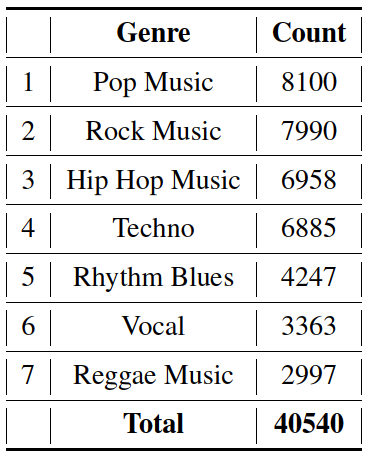
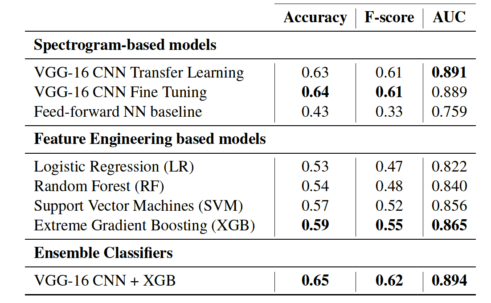
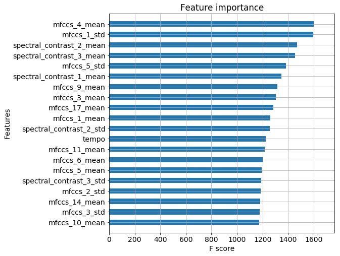

# Music Genre Classification
 

## Overview
Recognizing music genre is a challenging task in the area of music information retrieval. Two approaches are studied here:
1. Spectrogram based end-to-end image classification using a CNN (VGG-16)
2. Feature Engineering Approach using Logistic Regression, SVMs, Random Forest and eXtreme Gradient Boosting.

This project was carried out as a part of the course CS 698 - Computational Audio offered by [Prof. Richard Mann](https://cs.uwaterloo.ca/~mannr/) at the University of Waterloo. For a detailed description about the project, please refer to [this article](https://arxiv.org/abs/1804.01149) published on [arXiv](https://arxiv.org/).

## Datasets
The *Audio Set* data [released by Google](https://research.google.com/audioset/download.html) is used in this study. Specifically, only the wav files that correspond to the following class labels are extracted from YouTube based on the video link, start and end times. 

 

 

## Requirements
- tensorflow-gpu==1.3.0
- Keras==2.0.8
- numpy==1.12.1
- pandas==0.22.0
- youtube-dl==2018.2.4
- scipy==0.19.0
- librosa==0.5.1
- tqdm==4.19.1
- scipy==0.19.0
- Pillow==4.1.1

## Instructions
1. First, the audio wav files need to be downloaded using the tool [youtube-dl](https://rg3.github.io/youtube-dl/). For this run `audio_retrieval.py`. Note that the each file is about 880 KB, totally upto 34 GB!
2. Next, generate MEL spectrograms by running `generate_spectrograms.py`. If needed, you may modify the same file to change the Short Time Fourier Transform (STFT) parameters.
3. The next step is to run the models. Please refer to the corresponding Jupyter notebooks. The deep learning based models are present in notebooks 3.1, 3.2 and 3.3. Notebooks 4 and 5 contains steps for feature extraction (run `feature_extraction.py`) and building the classifiers using `sklearn`.

## Results
The models are evaluated on the basis on AUC, accuracy and Fscore. 
 

 

The most important 20 features based on the XGB classifier are shown below. The metric on the x-axis refers to the number of times a given features appears as a decision node in all of the decision trees used to build the gradient boost predictor.  

 

The confusion matrix of the ensemble XGB and CNN classifier: 
 

 

